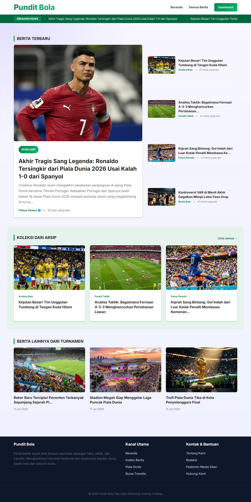
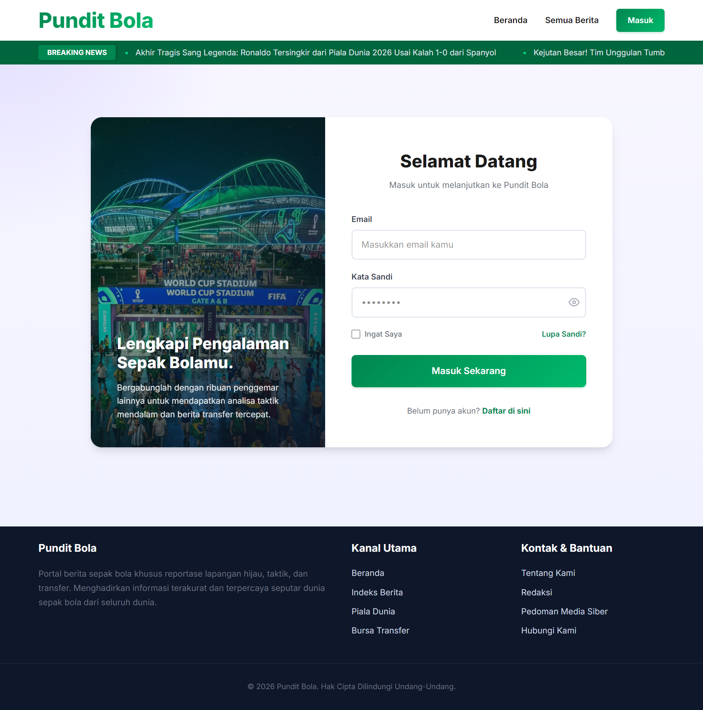

# Pundit Bola - Berita Olahraga

## 📋 Tentang Aplikasi

**Pundit Bola** adalah platform web yang dibangun menggunakan **Laravel** untuk menyediakan berita, analisis, dan informasi terkini seputar dunia olahraga, khususnya **sepak bola**. Website ini menyajikan konten berkualitas tentang pertandingan, analisis taktik, dan berita terbaru dari dunia sepak bola.

## 📸 Screenshot Aplikasi

### Halaman Home


### Login


## ✨ Fitur Utama

- **Berita Terbaru** - Artikel berita sepak bola yang diupdate secara berkala
- **Analisis Pertandingan** - Analisis mendalam tentang pertandingan dan strategi tim
- **Sistem Blog** - Platform untuk mempublikasikan dan mengelola artikel
- **Autentikasi Pengguna** - Sistem login dan registrasi untuk pengguna
- **Halaman Utama** - Tampilan home dengan berita unggulan
- **Metadata Artikel** - Informasi lengkap setiap artikel dengan tanggal, kategori, dan keterangan

## 🏗️ Struktur Aplikasi

### Database Models
- **User** - Model pengguna aplikasi
- **Post** - Model artikel/berita dengan metadata

### Fitur Database
- Migrations untuk setup tabel users, posts, dan cache
- Post metadata columns untuk informasi detail artikel
- Factory untuk testing data pengguna

### Views (Blade Template)
- `home.blade.php` - Halaman utama
- `posts.blade.php` - Daftar semua artikel
- `post.blade.php` - Detail satu artikel
- `master.blade.php` - Template dasar layout
- Folder `auth/` - Halaman autentikasi


## 🛠️ Teknologi yang Digunakan

- **Backend**: Laravel (PHP Framework)
- **Frontend**: Blade Template, CSS, JavaScript
- **Database**: MySQL/SQLite
- **Build Tool**: Vite
- **Testing**: PHPUnit

## 🚀 Cara Menjalankan

```bash
# Install dependencies
composer install
npm install

# Jalankan migration database
php artisan migrate

# Jalankan development server
php artisan serve

# Jalankan vite untuk asset bundling
npm run dev
```

## 📝 Konten Artikel

Platform ini menyediakan dua jenis konten utama:
1. **Berita Breaking** - Berita terkini dari dunia sepak bola
2. **Analisa Taktik** - Penjelasan mendalam tentang strategi dan formasi tim

Setiap artikel dilengkapi dengan:
- Tanggal publikasi
- Kategori konten
- Deskripsi lengkap
- Tag/metadata

---

**Dibuat dengan Laravel & ❤️ untuk pecinta sepak bola**
